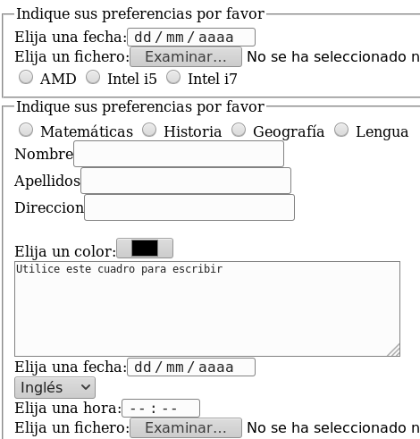

# Ejercicio
Diseñe un sitio Web que incluya el siguiente formulario, según las especificaciones dadas:

  - El "textarea" debe medir 10 filas y 60 columnas que lleva dentro el texto «Utilice este cuadro para escribir».
  - El elemento "select" (ComboBox) debe contener las siguientes opciones: 
    - Inglés
    - Francés
    - Alemán
    - Italiano   

# Tarea 
Cree un sitio Web en el que diseñe el siguiente formulario:

**En el campo "Método de pago" deben incluirse las opciones:**
  - Efectivo
  - Tarjeta de débito
  - Tarjeta de crédito
  
 **Todos los campos deben ser obligatorios**

